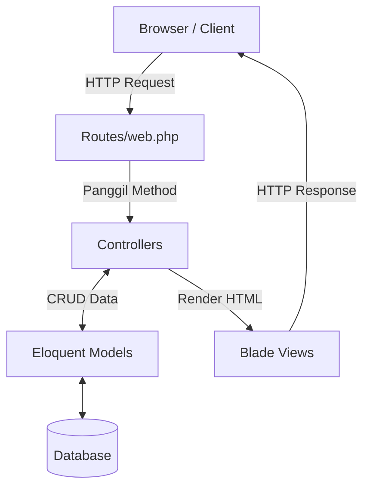

# Sambat Skanawa

Sebuah sistem informasi pengaduan masyarakat atau siswa berbasis web yang dirancang khusus untuk lingkungan sekolah (Skanawa). Aplikasi ini memberikan kemudahan bagi siswa untuk menyalurkan keluhan, saran, atau laporan kejadian secara terstruktur, serta memberikan ruang bagi pihak sekolah (admin dan petugas) untuk merespon laporan tersebut dengan cepat dan efisien.

## Preview Proyek

Sambat Skanawa memungkinkan pengguna (siswa) untuk mendaftar, login, dan mengirimkan laporan pengaduan—dengan opsi untuk melaporkan secara anonim (tanpa identitas). Di sisi lain, petugas atau admin memiliki akses dashboard untuk meninjau seluruh laporan, memproses pengaduan, memberikan tanggapan resmi, serta mengelola data master seperti data siswa dan akun petugas.

> *Screenshot/GIF preview aplikasi belum tersedia.*

---

## Fitur Utama

- **Autentikasi Multi-User**: Sistem login dan pendaftaran yang aman. Terdapat pemisahan akses antara Siswa dan Petugas/Admin.
- **Manajemen Pengaduan (Siswa)**: Siswa dapat membuat laporan pengaduan baru, memantau status pengaduan (menunggu, diproses, selesai), dan menggunakan fitur laporan anonim.
- **Manajemen Pengaduan (Admin/Petugas)**: Memungkinkan petugas untuk memverifikasi laporan yang masuk, mengubah status proses, serta memberikan tanggapan langsung pada setiap pengaduan.
- **Dashboard Informatif**: Menyajikan ringkasan dan statistik jumlah pengaduan, pengaduan yang diproses/selesai, serta total siswa dan petugas.
- **Manajemen Pengguna (Admin Only)**: Admin memiliki hak akses penuh untuk melakukan CRUD pada data Siswa dan Petugas. Termasuk fitur *Import* dan *Export* data Siswa menggunakan template yang disediakan.

---

## Teknologi yang Digunakan

Proyek ini dibangun menggunakan *stack* teknologi modern untuk menjamin performa dan kemudahan pengembangan:

- **Bahasa Pemrograman**: PHP ^8.2, JavaScript
- **Framework Backend**: Laravel ^12.0
- **Framework Frontend**: TailwindCSS ^4.0.0
- **Database**: SQLite (Default) / Mendukung MySQL & PostgreSQL
- **Asset Bundler**: Vite ^7.0.7
- **Tools Pendukung**: Composer, NPM

---

## Arsitektur Sistem

Aplikasi ini menggunakan pola arsitektur **Model-View-Controller (MVC)** yang merupakan standar bawaan dari framework Laravel.

- **Model**: Merepresentasikan struktur data pada database (Siswa, Petugas, Pengaduan, Tanggapan, Kategori) menggunakan fitur Eloquent ORM.
- **View**: Menangani presentasi UI kepada pengguna menggunakan template engine Blade dan dikombinasikan dengan styling dari TailwindCSS.
- **Controller**: Menghubungkan alur logika antara rute (Routes), data dari Model, dan tampilan yang akan di-render di View (misal: `PengaduanController`, `AuthController`).



---

## Struktur Folder

Berikut adalah direktori utama yang penting untuk dipahami dalam source code ini:

- `app/`: Berisi inti kode aplikasi. Terdapat folder `Models/` untuk entitas database dan `Http/Controllers/` untuk logika bisnis (terbagi antara Admin, User, dan Guest).
- `database/`: Memuat file `migrations/` untuk mendefinisikan skema tabel database dan file SQLite secara lokal.
- `public/`: Direktori web server (document root). Tempat penyimpanan file aset publik seperti gambar dan hasil build Vite (`build/`).
- `resources/`: Berisi file tampilan UI atau views (`views/`) berbasis Blade, serta source code mentah untuk CSS (`css/`) dan JavaScript (`js/`).
- `routes/`: Memuat definisi rute aplikasi (utamanya di file `web.php`).

---

## Persyaratan Sistem

Untuk dapat menjalankan aplikasi ini secara lokal, pastikan environment Anda memenuhi persyaratan berikut:

- **PHP**: Versi 8.2 atau lebih baru
- **Composer**: Versi 2.x
- **Node.js**: Versi LTS terbaru (disarankan) & NPM
- **Database**: SQLite (sudah terkonfigurasi secara default) atau server database lain yang didukung Laravel.

---

## Instalasi

Ikuti langkah-langkah berikut untuk meng-install dan menjalankan aplikasi di komputer lokal:

1. **Clone repository ini**
   ```bash
   git clone <repository-url>
   cd sambat-skanawa
   ```

2. **Install dependency PHP**
   ```bash
   composer install
   ```

3. **Install dependency JavaScript (Frontend)**
   ```bash
   npm install
   ```

4. **Konfigurasi Environment**
   Salin file konfigurasi bawaan dan sesuaikan dengan environment Anda.
   ```bash
   cp .env.example .env
   ```

5. **Generate Application Key**
   ```bash
   php artisan key:generate
   ```

6. **Setup Database dan Migrasi**
   Pastikan file database SQLite terbentuk.
   ```bash
   touch database/database.sqlite
   php artisan migrate
   ```
   *(Opsional)* Jalankan seeder jika ada data dummy yang disediakan: `php artisan db:seed`

7. **Build Aset Frontend**
   ```bash
   npm run build
   ```

8. **Jalankan Aplikasi**
   ```bash
   php artisan serve
   ```
   Aplikasi akan dapat diakses di `http://127.0.0.1:8000`.

---

## Konfigurasi Environment

Beberapa variabel di dalam file `.env` yang penting untuk diperhatikan:

- `APP_NAME`: Nama dari aplikasi ini (contoh: "Sambat Skanawa").
- `APP_ENV`: Environment aplikasi (`local` untuk development, `production` untuk server rilis).
- `APP_DEBUG`: Atur ke `true` saat tahap development untuk melihat detail error, dan **wajib** `false` saat production.
- `APP_URL`: URL utama tempat aplikasi diakses (contoh: `http://localhost:8000`).
- `DB_CONNECTION`: Tipe koneksi database. Secara default menggunakan `sqlite`. Ubah menjadi `mysql` atau `pgsql` jika menggunakan server eksternal, dan sesuaikan `DB_HOST`, `DB_PORT`, `DB_DATABASE`, dll.

---

## Cara Penggunaan

### Workflow Utama

1. **Guest/Siswa Baru**: Buka halaman utama aplikasi, pilih menu "Daftar" untuk membuat akun Siswa baru menggunakan NIS (Nomor Induk Siswa).
2. **Siswa**: Login dengan akun yang dibuat. Pada menu dashboard siswa, klik opsi untuk "Buat Pengaduan". Isi form pengaduan (Kategori, Judul, Isi Laporan) dan pilih apakah ingin mengirim secara anonim atau tidak.
3. **Petugas/Admin**: Login melalui halaman yang disediakan menggunakan akun admin. Buka halaman "Pengaduan" untuk melihat laporan baru dari siswa. Petugas dapat mengubah status laporan menjadi "Proses" atau "Selesai" dan memberikan balasan melalui fitur "Tanggapan".

---

## API Documentation

Aplikasi ini beroperasi menggunakan render view langsung (Server-Side Rendering) melalui file rute `web.php` dan belum mengimplementasikan antarmuka API publik secara khusus.

---

## Database Schema

Skema database didesain untuk menunjang relasi antar data pada proses pengaduan. Tabel utama meliputi:

- **`siswa`**: Menyimpan kredensial dan profil siswa (`nis` sebagai Primary Key, username, nama_siswa, kelas, no_hp, password).
- **`petugas`**: Menyimpan kredensial admin dan petugas (`id`, username, nama_petugas, level, password).
- **`kategori`**: Tabel referensi (lookup) untuk kategori atau jenis-jenis pengaduan.
- **`pengaduan`**: Tabel sentral yang menyimpan laporan (`id`, `kategori_id`, `siswa_nis`, `judul_laporan`, `isi_laporan`, `status`, `is_anonymous`).
- **`tanggapan`**: Menyimpan balasan atau respons resmi dari petugas terhadap pengaduan (`id`, `pengaduan_id`, `petugas_id`, `isi_tanggapan`).

**Relasi:**
- `Siswa` (1) memiliki banyak (N) `Pengaduan`.
- `Kategori` (1) memiliki banyak (N) `Pengaduan`.
- `Pengaduan` (1) memiliki banyak (N) `Tanggapan`.
- `Petugas` (1) memberikan banyak (N) `Tanggapan`.

---

## Deployment

Saat akan men-deploy aplikasi ini ke server *production*, perhatikan langkah berikut:
1. Pastikan ekstensi PHP yang dibutuhkan server telah terinstal (terutama database driver).
2. Ubah variabel `.env`: `APP_ENV=production` dan `APP_DEBUG=false`.
3. Jalankan command optimasi dari Laravel:
   ```bash
   php artisan config:cache
   php artisan route:cache
   php artisan view:cache
   ```
4. Build ulang aset frontend untuk production:
   ```bash
   npm run build
   ```
5. Arahkan *Document Root* dari web server (seperti Nginx atau Apache) ke folder `public/` di dalam project ini.

---

## Testing

Proyek ini telah dikonfigurasi untuk pengujian otomatis menggunakan PHPUnit dan dukungan fitur test bawaan dari Laravel.

- **Menjalankan Testing**:
  ```bash
  php artisan test
  ```
- **Jenis Testing**: Unit testing dan Feature testing (direktori `/tests`).

---

## Security

Praktik keamanan bawaan yang telah diterapkan:
- **Authentication & Authorization**: Akses URL dilindungi menggunakan Middleware Laravel (`guest`, `auth:petugas`, dan custom role `role:admin`).
- **Password Hashing**: Semua password pengguna disimpan menggunakan metode hashing standar yang aman (Bcrypt/Argon2).
- **CSRF Protection**: Menggunakan token bawaan `@csrf` pada semua form submission yang mencegah serangan *Cross-Site Request Forgery*.
- **SQL Injection Prevention**: Penggunaan Eloquent ORM mencegah modifikasi *query* secara langsung dari input user.

**Hal yang perlu diperhatikan saat deployment:** Pastikan untuk mengganti `APP_KEY` dan menjaga kerahasiaan file `.env`. Jangan pernah mempublikasikan akses direktori selain `public/`.

---

## Troubleshooting

Beberapa masalah umum dan solusinya:
- **Tampilan CSS berantakan atau tidak muncul:** Ini terjadi jika aset TailwindCSS belum di-build. Jalankan `npm install` lalu `npm run build` (atau `npm run dev` jika sedang tahap pengembangan).
- **Error 500 atau aplikasi *blank*:** Cek file log pada `storage/logs/laravel.log`. Kemungkinan file `.env` belum dibuat atau konfigurasi database salah.
- **Pesan error terkait Database/Migration:** Pastikan database (contoh: `database.sqlite`) memiliki *permission* baca/tulis yang benar (khususnya pengguna Linux/Mac) dan jalankan ulang `php artisan migrate:fresh` (peringatan: akan menghapus semua data).

---

## Roadmap

- [x] Sistem Autentikasi Multi-role (Admin, Petugas, Siswa)
- [x] CRUD Laporan Pengaduan & Tanggapan
- [x] Fitur Laporan Anonim
- [x] Fitur Import / Export Data Siswa
- [ ] *Belum teridentifikasi dari source code untuk fitur yang akan datang.*

---

## Kontribusi

Kami sangat menghargai kontribusi Anda! Jika Anda ingin menambahkan fitur, memperbaiki bug, atau meningkatkan kode:
1. Lakukan *Fork* repository ini.
2. Buat *branch* baru untuk fitur atau perbaikan Anda (`git checkout -b fitur/nama-fitur`).
3. Lakukan *commit* dengan deskripsi yang jelas (`git commit -m "Menambahkan fitur X"`).
4. *Push* ke branch tersebut (`git push origin fitur/nama-fitur`).
5. Buat *Pull Request*.

---

## License

Proyek ini menggunakan standar lisensi open-source bawaan framework Laravel, yaitu **MIT License**.

---

## Author

- **Pembuat Proyek**: -.
